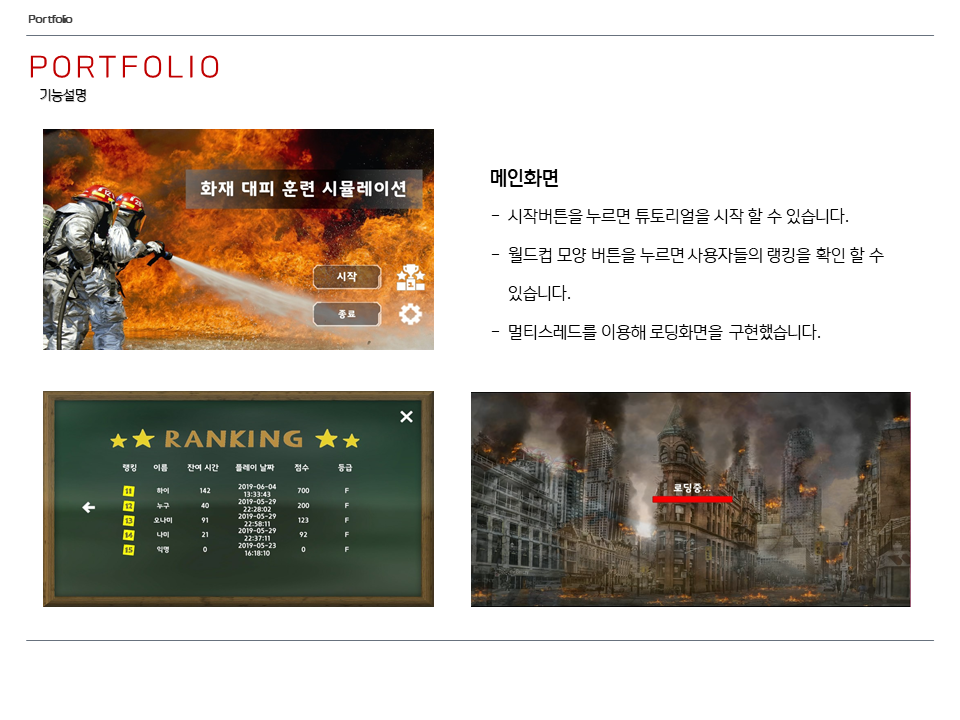
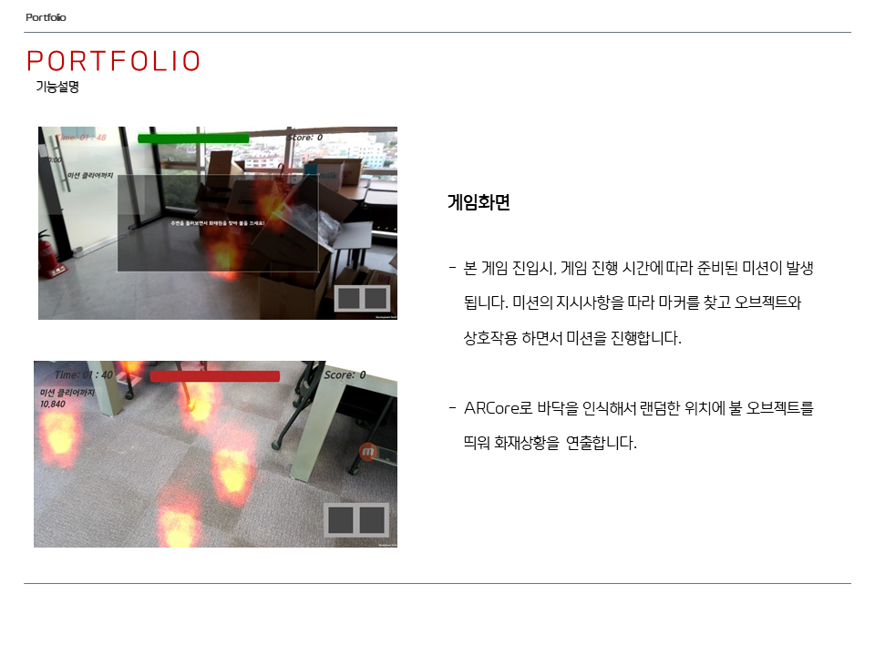
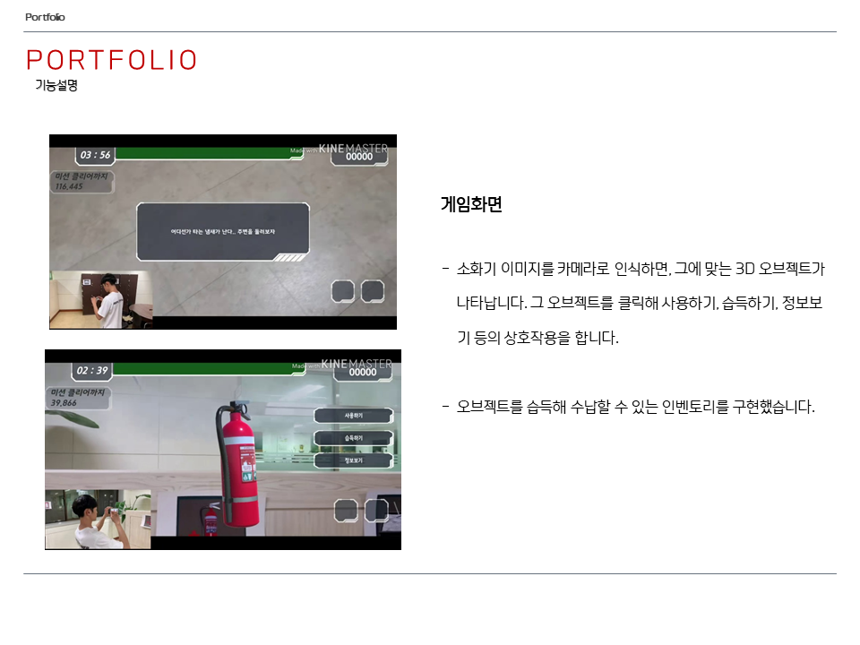
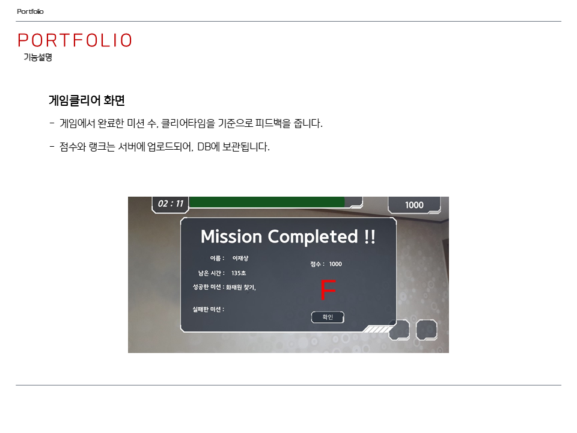

# 화재대피 훈련 AR
화재대피 훈련을 AR로 재현해서 행동요령을 습득할 수 있게하는 프로그램입니다.
AR을 이용하기 때문에, 머리가 아닌 몸으로 행동요령을 익힐 수 있는게 특징입니다.


## 사용기술
Unity, C#, ARCore, MySQL, PHP


## 실행법
```
# 깃 허브에서 소스코드를 다운로드 받습니다.
git clone https://github.com/bsw112/Virtual-fire-drill-cleanVer.git

# Unity로 프로젝트를 엽니다. 개발환경은 Unity 2018.3.1f1 버전입니다.

# BuildSetting을 Android로 바꾸고 빌드합니다.

# AR을 체험하기 위해서는 Asset/Images 폴더에 있는 이미지를 출력해야합니다.
해당 이미지를 카메라로 인식시키면 3D 오브젝트가 생성됩니다.
지원하는 이미지 목록 : elevator, exit, extinguisher, multitap, oilStove, towel, gasValve, sand, WaterBucket, cat

!! The type or namespace name 'NetworkBehaviour' could not be found 라는 에러가 발생하면
Window > Package Manager 에서 Multiplayer HLAPI 와 XR Legacy Input Helpers 를 인스톨 해야합니다.


```


## 주요기능
* 카메라로 이미지를 인식해서 3D 오브젝트 생성
* 생성된 3D 오브젝트와의 상호작용으로 미션 수행
* 플레이 타임 경과에 따른 미션 발생
* 인벤토리 시스템
* 게임 클리어시 완료한 미션의 갯수, 클리어 타임에 따라 피드백을 하고 그 정보를 DB에 저장. 
* 스코어에 따른 유저 랭킹 시스템 구현


## 실제화면





## 시연
[](https://www.youtube.com/watch?v=Q7QbUZA8FHQ&t=62s)
